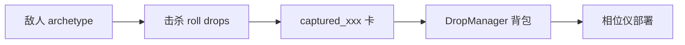

# 100 敌人 + 缴获卡 改造说明

## 目标

- 清单 **100 条全部是战场敌人**（`archetype_id`）。
- 在**特定时机**（默认：击杀）掉落对应 **缴获卡** `captured_<archetype_id>`，进背包后可部署。
- 显示名无「一战/二战」前缀（见 `card_icon_manifest_100_zh.md`）。

## 数据流



## 代码入口

| 文件 | 作用 |
|------|------|
| `data/enemy_unit_manifest.gd` | 100 条：敌人 id、掉落卡 id、模板平台卡、掉落率 |
| `data/captured_unit_cards.gd` | 注册 `captured_*` 为 `CardResource`（克隆 `platform_*` 等模板） |
| `data/enemy_archetypes.gd` | `GENERATED_PER_ERA=0`；合并清单敌人 + 强制 `drops` |
| `data/default_cards.gd` | 启动缓存时注册缴获卡 |
| `managers/drop_manager.gd` | 仍拦截 `platform_*` 直掉；**不拦截** `captured_*` |

## ID 规则

| 类型 | archetype_id 示例 | 掉落 card_id |
|------|-------------------|--------------|
| 原我方平台 | `foe_platform_ww1_light` | `captured_foe_platform_ww1_light` |
| 原精英掉落平台 | `foe_bulwark` | `captured_foe_bulwark` |
| 固定敌人 | `enemy_ww2_infantry` | `captured_enemy_ww2_infantry` |
| 补充池 | `foe_pool_012` | `captured_foe_pool_012` |

## 掉落时机（当前 / 可扩展）

| drop_trigger | 状态 | 说明 |
|--------------|------|------|
| `on_kill` | **已实现** | `BattleDamageSystem.roll_blueprint_drops` → `drops[].chance` |
| `phase_master_win` | 文档预留 | 相位师胜利额外池，可在 `GameManager` 奖励处按表发放 |
| `era_unlock` | 文档预留 | 时代首次通关礼包 |

扩展方式：在 `EnemyUnitManifest` 行上增加 `drop_trigger`，掉落管线读取后再决定是否 `grant`。

## 与我方进化 / 教学池的关系

- `platform_*` 仍存在于 `default_cards`（进化树、数值模板），但**不能**经掉落直进背包（`DropManager` 拦截）。
- 玩家获得同款单位应走 **击杀 `foe_platform_*` 敌人 → `captured_foe_platform_*`**。
- 新游戏相位仪仍可用 `omega_platform` / 能量卡起步（见 `PhaseInstrumentManager._equip_starter_cards_for_new_game`）；若需「零赠送、全靠缴获」，需另改开局装备逻辑。

## 策划改表

1. 显示名、era：改 `docs/card_icon_manifest_100_zh.md` 与 `enemy_unit_manifest.gd` 内数组保持一致。  
2. 掉落率：改 `EnemyUnitManifest._default_drop_chance` 或各行 `drop_chance`。  
3. 新增第 101 条：在 manifest 三处数组同步 + `CapturedUnitCards` 自动注册。

## 校验命令

```powershell
& "E:\下载\Godot_4.41\Godot_v4.5-stable_win64.exe" --headless --rendering-driver opengl3 --path "." --check-only
```
